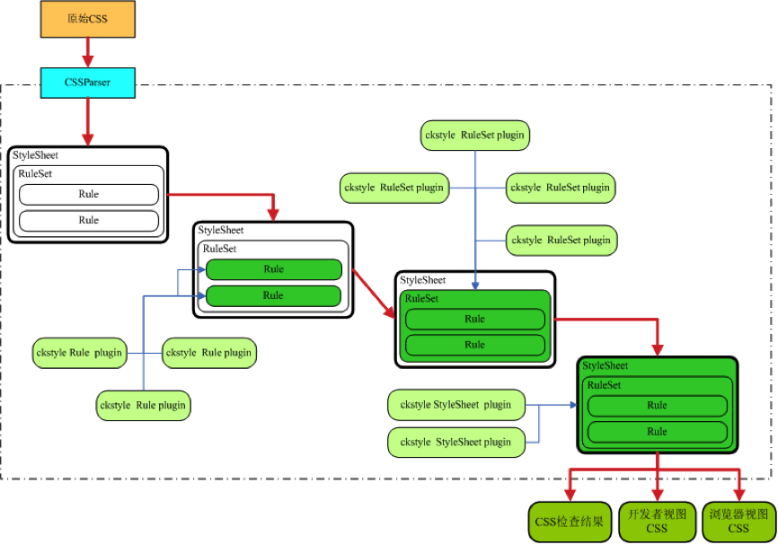
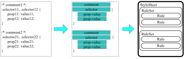
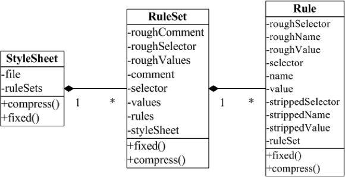






# CKStyle —— 一脉相承的CSS工具

## 前言

无工具，不规范。

业内能够找到的大部分CSS编码规范中，都会对CSS的编写方式进行严格的约束和说明，但是如何在实际开发过程中，确保代码能够严格遵循规范的要求，是规范制定者必须要考虑的问题。

人为遵守规范，是规范制定的初衷，也是最终目标，但是在规范没有变成习惯之前，人为遵守终归是“不靠谱”的。因此：“无工具，不规范”，有了规范，必定需要配套的工具来确保规范的执行。

说起来也比较奇怪，同样是前端开发的三大语言之一，CSS的检查工具备受冷落，而JS的代码规范检查工具则层出不穷。JSLint/JSHint/gjslint等神器不断涌现，且检查的严格程度令人瞠目结舌，但是CSS的检查工具却寥寥无几，仅有的一些检查工具，也只对CSS的取值、是否符合W3C规范进行了检查，对于代码风格只字不提，而各大互联网公司的开发规范中，对于代码风格是有严格约束的。因此：
> 一个严格按照规范检查CSS代码风格问题的工具是必不可少的

另外，CSS的检查、修复、排序、合并、压缩等功能，是相互关联的，并不是相互孤立的。

比如：只有进行了完整的CSS代码修复与合并，才能最大限度的实现压缩。而目前已有的CSS检查、属性排序、压缩等工具，实现方式五花八门，实现语言也是多种多样，不利于把CSS相关的功能有机的整合在一起，也不利于工具的集成和功能的扩展。因此：

> 依据完善的开发规范，实现一个自动修复CSS代码（为开发者）、并在修复的基础上压缩代码（为浏览器）的工具，也是很有必要的。

因此，ckstyle（全称是CSSCheckStyle）就应运而生了。

它自主实现了CSS的解析、检查、修复与压缩，不仅能够检查出CSS的代码风格和取值问题，还能够对CSS代码进行自动修复和压缩，给出符合规范的“开发者视图”代码和高效率的“浏览器视图”代码。此外，它充分利用插件的特性，可以方便灵活的实现功能扩展。
目前此工具已经在github上开源，欢迎大家围观，并加入我们：

> [https://github.com/wangjeaf/ckstyle-node](https://github.com/wangjeaf/ckstyle-node)

## 部分已有的CSS工具分析
为了避免重复造轮子，我们先分析一下现有的一些CSS相关的自动化工具，这里主要分析以下三个工具：

- CSS代码压缩工具： YUICompressor
- CSS代码检查工具： CSSLint
- CSS属性重排工具： CSSComb
- Grunt推荐的CSS压缩工具： clean-css

### YUICompressor
YUICompressor是基于Java的CSS代码压缩工具（目前已经有了Nodejs版，叫cssmin，原理类似）。主要实现原理是：

1. 将CSS文件读取并解析成字符串
2. 利用正则表达式，替换该字符串中的“应该被替换”的内容
3. 替换完成之后的字符串即为CSS压缩后的内容

下面是YUICompressor的部分源码
```css
// remove unnecessary semicolons
css = css.replaceAll(";+}", "}");

// Replace 0(px, em, %) with 0.
css = css.replaceAll("([\\s])(0)(px|em|%|in|cm|mm|pc|pt|ex)", "$1$2");

// Replace 0 0 0 0; width 0;
css = css.replaceAll(":0 0 0 0(;|})", ":0$1");
css = css.replaceAll(":0 0 0(;|})", ":0$1");
css = css.replaceAll(":0 0(;|})", ":0$1")
```

由于YUICompressor的这种实现方式，导致了它必然存在一些缺陷，例如：

1、代码压缩率有限，不能实现高级的CSS压缩，比如下面所示的规则压缩：

```css
.test {
   margin-top: 10px;
margin-right: 10px;
   margin-bottom: 10px;
   margin-left: 10px;
}

-->

.test {margin:10px}
```

2、由于所有规则都已经在源代码中硬编码，所以除非修改核心源码，否则不能很好的实现功能扩展

### CSSLint

CSSLint是用JavaScript实现的，用于检查CSS取值和潜在问题的工具，他使用了Nicholas大神的parser-lib作为CSS解析器，并按照parser-lib给出的API来编写检查规则。例如：检查一个规则是否为空的核心代码如下：

```javascript
init: function(parser, reporter) {
	var rule = this,
		count = 0;
	
	parser.addListener('startrule', function() {
		count = 0;
	})
	
	parser.addListener('property', function() {
		count ++;
	})
	
	parser.addListener('endrule', function(event) {
		var selectors = event.selectors;
		if (count == 0) {
			reporter.report('Rule is empty.', selectors[0].line, selectors[0].col, rule)
		}
	})
}
```

分析其源码可以得知，CSSLint的每一个规则都是通过监听parser给出的事件来进行相应的判断：

1. startrule为规则开始
2. property为找到一个属性时的事件
3. endrule为一个规则结束

一旦规则结束并且没有统计到任何property，则说明规则为空。

CSSLint很好的利用了插件机制，实现了检查规则的灵活扩展，构建了一个良性的规则开发和运行生态，但是它也存在一些不足：

1、没有针对代码风格的检查，并且缺失部分检查规则。例如：下面的代码在CSSLint检查完成之后认为是没有任何问题的。

```css
.test1 ul li a {
width:10px;
color:#ffffff;
    -webkit-border-radius:3px;
-moz-border-radius : 3px;
border-radius:3px
}
```

实际上，不难发现，上述代码问题还非常多。

2、检查出来的CSS问题，没有实现相应的修复方法，比如width:0px可以简化成width:0。需要开发者根据提示，人工修复。

3、插件的编写略显复杂，插件中的核心操作元素是一系列的事件及其监听函数，而不是需要检查的目标（比如文件、规则、属性）本身。


### CSSComb

一个CSS规则中的属性编写顺序，会影响到浏览器的渲染效率，推荐按照“显示属性、盒模型、文本属性、其他属性”的顺序来编写。
在编写CSS时手动调整顺序显得过于繁琐，因此CSSComb就有了它的用武之地。它能够按照推荐的CSS属性排列顺序，将CSS的所有属性重排。

例如：
```css
.test {
   width: 100px; 	/*盒模型*/
   height: 100px; 	/*盒模型*/
   border: none; 	/*盒模型*/
   font-size: 16px; 	/*文本属性*/
   display: none; 	/*显示属性*/
}
```

经过CSSComb的重新排列，将会变成符合推荐顺序的排列方式：

```css
.test {
   display: none; 	/*显示属性*/
   width: 100px; 	/*盒模型*/
   height: 100px; 	/*盒模型*/
   border: none; 	/*盒模型*/
   font-size: 16px; 	/*文本属性*/
}

```

值得一提的是，CSSComb提供了大量的编辑器扩展，通过简单的编辑器命令或操作，即可实现属性的批量重排，使用起来非常方便。
	
该工具存在的一些问题如下：

1. 与YUICompressor一样，所有功能集于一个文件，不能很好的实现功能扩展（虽然属性排序也不需要太
多扩展哈~）
2. 功能相对来说比较单一（也可以说是专注哈~）


### clean-css

clean-css的压缩率目前是业内工具中最高的，已经被Grunt小组采纳，并开发了Grunt官方推荐的压缩插件 grunt-contrib-cssmin

clean-css完全采用Nodejs进行开发，并提供了Nodejs环境和命令行下两种使用模式，当然，经过简单的转化，完全可以运行在浏览器端，像ckstyle官网目前就加入了这一功能，用于对比。

该工具的优点自不用多说，实现精致轻巧、深入分析CSS、功能比较完整、应用广泛。

工具的缺点也有不少：

1. 由于采用了相对封闭的解析和压缩方式，代码显得不明觉厉，想扩展功能很难。
2. 只做CSS压缩，虽然很专注，其他工具无法很好的使用它的成果。
3. 功能并不完善，例如：

```css
.test1 {
    *display: none;
    border: 1px solid #FFFFFF;
    margin: 10px;
    _display: inline-block;
    margin-top: 20px;
}

.test2 {
    *display: none;
    border: 1px solid #FFF;
    _display: inline-block;
    margin: 20px 10px 10px;
}
```

可以压缩成

```css
.test1,.test2{*display:none;_display:inline-block;margin:20px 10px 10px;border:1px solid #FFF}
```

但是目前clean-css并没有做到这一压缩。而当我想为clean-css添加这一功能时，非常困难。

### 总结

不论是代码检查、属性排序，还是代码压缩，对于前端开发来说，这几个工具都是必须要使用的。但是，通过以上分析，以及下面的总结表格，很容易看出，如果要在前端开发环境中集成这些工具，并且对这些工具进行统一灵活的扩展和完善，成本非常高。

工具 | 功能 | 实现语言 | CSS解析器
------------ | ------------- | -------------- | --------------
YUICompressor | CSS代码压缩 | Java/JavaScript | 无
CSSLint | CSS代码检查 | JavaScript | parse-lib(in JS)
CSSComb | CSS属性重排 | PHP | 自带(in PHP)
clean-css | CSS代码压缩 | JavaScript | 自带(in JS)

## CKStyle需要解决的问题

综合以上的工具分析结论，ckstyle需要解决的问题如下：

### 自主完成CSS的解析

为什么不用parser-lib，而需要自己开发解析器呢？主要原因如下：

1. 通过CSSLint的插件编写方式可以看出，parser-lib给出的API，对于编写检查规则来说相对比较复杂。
2. parser-lib解析过程中，给出的代码风格方面的API不足，导致代码风格检查很难进行。

因此，自主研发的CSS解析器，应该具备以下几个方面的特征：

1. 解析过程中，要保留原始的代码信息，以便进行代码风格的检查。
2. 能够预留非常方便的API，以供插件规则来检查或修复代码。
3. 按照StyleSheet/RuleSet/Rule的结构来生成解析内容，便于对规则进行划分，用不同类型的规则来检查不同内容。

### 建立方便灵活的功能扩展机制

ckstyle需要完成的使命光荣而艰巨，并非一朝一夕之功，需要不断收集用户反馈并不断优化完善。

为了把修改和完善的成本降到最低，ckstyle采用插件的机制，来扩展工具的功能，每一个插件完成一种或一组规则的检查和修复，这样一来，一旦发现某种规则缺失，或者实现过程中出现问题，添加或修改插件代码即可，无需改动整个工具的框架结构。

> 目前ckstyle实现的所有检查和修复功能，都是在插件中完成的。

### 检查CSS的代码风格问题

对于代码风格问题的检查，目前并没有比较好的检查工具，因此为了确保规范的严格执行，此功能必须包含。

由于CSS解析过程中，保留了代码的原始信息，因此代码风格问题的检查就比较顺利了。

### 检查并修复CSS的代码问题

一般情况下，如果能够检查出一种代码问题，就意味着知道这个问题应该如何修复。在ckstyle的自动修复实现过程中，大多数问题是可以自动修复的，比如：将#FFFFFF替换为#FFF，但是也有很多问题是无法自动修复的，比如：在CSS代码中使用了!important，如果自动修复这个问题，将影响最终的功能实现。

因此，自动修复分为以下两种情况：

1、修复不压缩

修复不压缩，说明最终生成的是“开发者视图”的CSS，此时，如果遇到不能自动修复的问题，则自动为该代码生成一个特殊注释：/* TOFIX */，标识此处无法自动修复，请人工修复。

2、修复且压缩

修复且压缩，意味着最终生成的是“浏览器视图”的CSS，在这种视图中，将按照所有已知的压缩规则，最大限度的压缩CSS代码，因此不会生成特殊注释，而是对无法自动修复的问题采取“鸵鸟策略”，对此问题“置之不理”。

### 在修复的基础上压缩代码

只有代码做到了足够的精简、规范，才能最大限度的实现压缩。

下面是一个典型的示例：

```css
.test {
   margin-top: 0px;
   margin-right: 0;
   margin-bottom: 0px;
   margin-left: 0px;
   display: none;
}
.test2 {
display: none;
   margin: 0;
}

-->

.test, .test2 {
   display: none;
   margin: 0;
}

-->

.test, .test2 {display:none;margin:0}
```
针对以上代码：

1. 只有对每一个Rule采用“0后的单位可以省略”的规则，才能确保所有的margin-*取值一致，便于后续合并；
2. 只有对每一个RuleSet采用“合并margin-* 为margin”的规则，才能确保四个margin-* 最终合并成一个。
3. 只有对每一个RuleSet采用“按照推荐的顺序编写属性”的规则，才能确保display和margin的顺序符合规范，并且为“合并相同属性的规则”提供便利。
4. 只有对整个StyleSheet采用“合并相同属性的规则”的规则，才能最大限度减少重复代码。

通过一系列规则的自动修复，最终达到上述代码中最底部的合并和压缩效果。

可以看出，

> 只有代码足够精简、规范，才能最大限度的实现压缩

## CKStyle的处理方案

ckstyle的处理流程如下图所示：



说明：

1. CSSParser通过逐字解析CSS文本内容，建立StyleSheet/RuleSet/Rule的对象结构，保存解析后的属性值，并完全保留原始代码的缩进、空格、回车等代码风格信息。

2. ckstyle Rule Plugin，包含了针对某一种属性级别的代码规范的检查器实现，它的check方法将对每一个Rule进行对应的检查，如果是修复或压缩，则将使用其fix方法进行对应的修复。

3. 其他两种Plugin与ckstyle Rule Plugin类似，区别在于：ckstyle RuleSet Plugin针对的是规则级别的，而ckstyle StyleSheet Plugin针对的是整个样式表文件级别的。

4. 任何与规范、检查、修复相关的内容都是一个Plugin，每一个Plugin，都可以包含检查和修复两个部分的功能；代码的压缩和格式化，由每一个StyleSheet/RuleSet/Rule实体来自行承担。

5. 所有Plugin检查或修复完毕以后，将产生最终的处理结果。如果是检查，则会给出检查结果说明；如果是修复，则会给出修复后并格式化完毕的“开发者视图”代码；如果是压缩，则会在修复后进行最小化输出，给出“浏览器视图”代码。

具体细节将会在后续的章节中进行详细的描述。

## CSS的解析

相比于JavaScript或Java等语言的复杂语法，CSS的编写方式相对来说比较固定，解析器实现起来也相对简单。因此，本工具实现了一个简单的CSS解析器。

一般情况下，CSS的整体解析和处理流程如下图所示：



在解析完成之后，StyleSheet/RuleSet/Rule等实体类中保存了CSS解析过程中的原始代码和清理后的代码两部分信息，前者用于检查代码风格，后者用于检查取值。

三种实体类的类图及其关系简图如下所示：


每一个实体类中都包含compress和fixed两个方法，前者用于生成压缩后的代码，后者用于生成修复后的代码。

## 基于插件的检查和修复机制

为了最大限度的实现灵活扩展和可插拔，本工具采用插件机制来加载需要的规则检查类，每一个插件类对应一种或一组检查规则，同时，每一个插件类包含check和fix方法，分别用于检查和自动修复。

### 插件类的结构与规范

插件类的结构和继承关系简图如下所示：

ckstyle的所有与CSS检查、修复有关的功能，都将通过插件的形式来完成。

插件类PluginClass有以下几个约束：

1、插件类文件必须放置在plugins目录下

2、插件类的类名必须与插件的文件名相同

3、插件类必须按照检查的类型，继承自RuleChecker/RuleSetChecker/StyleSheetChecker当中的一个

4、插件类必须包含id（规则唯一标识）、errorLevel（错误级别）和errorMsg（错误消息）三个属性，id不能与其他插件类重复。

5、插件中可以（并不必须）包含check方法（用于检查代码问题）和fix方法（用于自动修复），其中：

5.1 check方法和fix方法拥有相同的参数，第一个为self（js类实例），第二个为该插件
类需要操作的实体类，例如rule/ruleSet/styleSheet，第三个为全局配置对象。

5.2 check方法的必须返回：True（检查通过）/ False（检查不通过）/ Array（错误消息数组）

5.3 为了避免自动修复的相互覆盖，fix方法中统一针对fixedXxxx的属性进行操作，比如Rule
实体的fixedName，fixedValue等。

6、errorMsg中可以包含${selector}、${name}、${value}，在错误信息解析时将自动替换
	
以“0后的单位可以省略”的规则为例，该规则对应的插件代码如下：

```javascript
var base = require('../base')
var ERROR_LEVEL = base.ERROR_LEVEL
var Class = base.Class
var RuleChecker = base.RuleChecker
var helper = require('./helper');

var pattern_unit = /^[0]+[\w]+/g
var replacer_unit = /,\s+/g

module.exports = global.FEDNoUnitAfterZero = new Class(RuleChecker, function() {
    
    this.__init__ = function(self) {
        self.id = 'del-unit-after-zero'
        self.errorLevel = ERROR_LEVEL.WARNING
        self.errorMsg = 'unit should be removed when meet 0 in "${selector}"'
    }

    this.check = function(self, rule, config) {
        var values = rule.value.split(' ')

        for(var i = 0; i < values.length; i++) {
            var v = values[i];
            v = v.trim()
            if (v.indexOf('(') != -1) {
                matched = self._startsWithZero(v.split('(')[1])
            } else {
                matched = self._startsWithZero(v)
            }
            if (!matched)
                continue

            for(var j = 0; j < matched.length; j++) {
                var m = matched[j]
                if (m != '0s' && m != '0ms') {
                    return false;
                }
            }
        }

        return true 
    }

    this.fix = function(self, rule, config) {
        if (rule.name == 'expression')
            return

        var fixed = rule.fixedValue
        rule.fixedValue = rule.fixedValue.replace(/,/g, ', ');

        var collector = []
        rule.fixedValue.split(' ').forEach(function(v) {
            v = v.trim()
            if (v.indexOf('(') != -1) {
                matched = self._startsWithZero(v.split('(')[1])
            } else {
                matched = self._startsWithZero(v)
            }

            if (!matched) {
                collector.push(v)
                return
            }

            var finalV = v;
            for(var j = 0; j < matched.length; j++) {
                var m = matched[j]
                if (m != '0s' && m != '0ms') {
                    finalV = finalV.replace(m, '0')
                }
            }

            collector.push(finalV)
        })

        rule.fixedValue = collector.join(' ').replace(replacer_unit, ', ')
    }

    this._startsWithZero = function(self, value) {
        var matched = value.match(pattern_unit)
        return matched
    }

    this.__doc__ = {
        "summary":"删除0后面的单位",
        "desc":"0后面的单位可以删除，以实现更好的压缩。比如 <code>0px ==> 0</code> ，<code>0em ==> 0</code> 等，\
            但是<code>transition: 0s</code>的<code>s</code>不能省略"
    }
})
```

说明：

1. 插件的文件名为：FEDNoUnitAfterZero.js，放置在ckstyle/plugins目录下

2. 该文件中包含一个继承自RuleChecker的类，该类名为FEDNoUnitAfterZero

3. 该类包含的id为 del-unit-after-zero，errorLevel为WARNING级别，同时包含错误消息设置。

4. 此插件类中包含了check方法和fix方法，check方法在找到类似于”0px” “0em”的情况下，返回false，否则返回true；fix方法则针对于Rule实体的fixedValue属性，用“0”替换“0px”或“0em”等值，实现修复。

### 插件的加载和使用

只有了解了插件的加载和使用过程，才能更好的理解以上插件开发规范的由来和目的。

按照插件的开发规范，所有的插件类都放置在plugins目录下，且插件类的具体开发内容也必须遵守上述规范。

有了上述规范，就可以通过以下几个步骤，加载插件并使用插件的有关功能：

1. 遍历plugins目录下的所有 js 文件（base.js和helper.js除外）
2. 根据js文件名，通过require，获取文件内的同名类，该类即为插件类
3. 按照配置信息（如命令行参数、配置文件参数），构造插件类的实例，并按照类型分类，保存备用。
4. 当需要检查Rule/RuleSet/StyleSheet时，使用对应插件的check方法来检查代码问题，fix方法来修复代码问题即可，如果插件不存在check或fix方法，则不进行对应操作。

### 插件的开发

了解了插件类的结构和插件的加载使用，对于插件的开发就应该有一定的认识了。

如果您想为ckstyle开发一款插件，则您必须：

1. 按照插件类的结构和规范，编写插件类文件
2. 把此文件放置在ckstyle/plugins目录下
3. 在 `test` 目录下，为您的插件类添加详细的单元测试，单元测试的编写方式请参见“单元测试”小节。

非常期待能够在plugins目录下看到您的作品。

### 现有插件及其说明

请参见这里 [CKStyle现有插件列表](https://github.com/wangjeaf/ckstyle-node/issues/17)

## 单元测试

### CSS版单元测试

CSS版单元测试，通过编写CSS文件来编写用例和断言，主要用于测试“代码检查”的功能。凡是放在 `test` 目录下的、不是以_开头的CSS文件，都认为是单元测试文件。
每一个单元测试文件包含断言和待测试代码两部分内容：

1. 通过@unit-test-expecteds来定义的断言，断言的key为错误优先级，value为错误信息。
2. 按照普通CSS的书写风格来编写的待检查的CSS，所有错误信息都将被收集。
	
在检查的过程中，单元测试框架收集@unit-test-expecteds中的断言内容，并且检查剩余的所有CSS中的代码问题，通过断言与实际代码问题的对比，确定功能是否正确。对比规则如下：

1. 如果断言中存在，而实际检查不存在的问题，则给出[expect but not have]的方式给出错误提示。
2. 如果断言中不存在，而实际检查存在的问题，则给出[unexpect but has]的方式给出错误提示。

以FEDNoUnitAfterZero的单元测试CSS文件为例。其断言为：

```css
@unit-test-expecteds {
    1: unit should be removed when meet 0 in ".test-zero-px"
    1: zero should be removed when meet 0.xxx in ".test-zero-dot-one-px"
    1: unit should be removed when meet 0 in ".test-padding"
}
```

而待测试的部分代码如下：

```css
.test-zero-px {
    width: 0px;
}
.test-zero {
    width: 0;
}
.test-zero-dot-one-px {
    width: 0.1px;
}
.test-padding {
    padding: 1px 0px;
}
.test-padding-start-with-zero {
    padding: 0 1px 0 1px;
}
```

断言给出的几种错误，确实在待测试的代码中出现了，不多也不少，也只有这样，整个测试用例才算正确通过了。

这种单元测试开发方式的优点是：

1. 断言和待测试代码放在同一个文件中，便于快速定位问题
2. 断言和待测试代码独立开来，避免两种代码揉在一起，相互混淆
3. 保留了CSS代码的原始编写风格，无需为了测试做任何额外的改变
4. 如果添加的代码没有任何问题，则只需要编写CSS代码即可，无须改动断言

以上几个优点，对于测试代码的编写而言，都是非常舒服惬意的。

### JS版单元测试

CSS版单元测试，主要解决的是代码检查的单元测试，对于代码自动修复、代码压缩等复杂功能的测试，无法很好的总结出一种通用的测试编写模式，因此提供了js版的单元测试编写方法。

为了简化断言的编写，js版单元测试提供了类似QUnit的断言API，按照实际情况，目前包括：

1. ok (flag, msg)
2. equal (actural, expected, msg)
3. notEqual (actural, expected, msg)
	
凡是放置在 `test` 目录下的，非helper.js、run.spec.js的js文件，都认为是单元测试文件。

run.spec.js，是单元测试运行器，是提供给Mocha用的，该文件，负责收集当前目录下的所有测试用例。

每一个单元测试文件的编写规则如下：

1. 文件中通过ok/equal/notEqual等方法编写断言，并且收集错误信息
2. 模块必须导出doTest方法，并将此方法作为测试的执行方法
	
下面是一个简单的自动修复属性顺序的测试示例，需要说明的是，目前ckstyle的所有JS版单元测试目录，都提供了相应的helper来封装需要的额外操作，因此示例中只需要引入helper的成员即可。

```javascript
var doFix = require('./helper').doFix;

exports.doTest = function() {
    var result = doFix('.test {width:"100px";color:#DDDDDD;}', '')
    fixer = result[0];
    msg = result[1];
    styleSheet = fixer.getStyleSheet()
    equal(len(styleSheet.getRuleSets()), 1, 'one ruleset') // 断言1
    ruleSet = styleSheet.getRuleSets()[0]
    equal(ruleSet.selector, '.test', 'it is the selector that i need') // 断言2
    width = ruleSet.getRuleByName('width')
    equal(width.fixedValue,  "'100px'", 'width is fixed') // 断言3
    equal(width.value, '"100px"', 'value of width is origin') // 断言4

    color = ruleSet.getRuleByName('color')
    equal(color.fixedValue, '#DDD', 'color is fixed') // 断言5
    equal(color.value, '#DDDDDD', 'value of color is origin') // 断言6
}
```

上面的测试，自动修复了一段CSS程序，并且通过一系列的断言，保证了：

* 断言1：整个样式表只有一个规则，规则个数正确
* 断言2：确保唯一的规则的CSS选择器是正确的
* 断言3：属性重排以后的第一个规则的name为display，属性重排顺序正确
* 断言4：属性重排以后的第二个规则的name为width，属性重排顺序正确
* 断言5：属性重排以后的第一个规则的value为none，取值正确
* 断言6：属性重排以后的第二个规则的value为100px，取值正确

JS版的单元测试，弥补了CSS版单元测试的不足，其优点是：
	
1. 能够很好的实现不同类型的测试效果
2. 通过简单的断言API，测试代码的编写清晰易懂
3. 无需过多考虑测试框架，编写JavaScript程序放置在对应目录，即可完成测试，方便快捷

综合运用两种单元测试，将使测试代码的编写更加简洁高效。

## 命令行工具的安装与使用

目前ckstyle已经加入了npmjs，通过npm install即可一键安装，并自动生成命令行工具，方便使用。

安装命令为：

```
[sudo] npm install -g ckstyle
```

目前ckstyle 包含了一下几个子命令：

- check 检查
- format 简单格式化
- fix 自动修复 + 格式化
- compress 压缩
- serve 启动CKService服务

具体使用方法、命令行参数、配置方式、使用示例，请移步 [ckstyle的开源github项目地址](https://github.com/wangjeaf/ckstyle-node) 或 [ckstyle官网](http://ckstyle.github.io/)

## 总结

在CSS编码规范制定完毕但是检查工具效果差强人意的情况下；

在CSS代码风格检查工具缺失导致规范中的代码风格相关规范无法很好保证的情况下；

在CSS工具五花八门各司其职但是实现方式迥异导致工具整合困难使用困难扩展困难的情况下；

在CSS代码在Rule/RuleSet/StyleSheet三个级别持续优化后压缩率能够变得更低CSS效率变得更高而没有工具良好支撑这种优化的情况下；

在CSS应该自动检查发现问题并且自动分情形修复从而开发者能够无后顾之忧的在不影响开发效率的前提下不断提高编码规范程度并优化产出但是没有工具能够良好支持的情况下；

一脉相承的CSS解析、检查、修复、压缩的自动化工具ckstyle应运而生。

目前该工具在检查、修复、压缩等方面都表现出了强劲的生命力和竞争力。未来，我们会在ckstyle上持续发力，致力于打造一款“多层次全方位立体式”的CSS工具集，希望更多的有识之士能够加入我们，加入到这个工具的建设中来。

如果您对此工具很感兴趣，或者发现此工具的任何问题，请在github上给我留言。

```
https://github.com/wangjeaf
```

—— [wangjeaf@github](https://github.com/wangjeaf) [wangjeaf@weibo](http://weibo.com/wangjeaf)